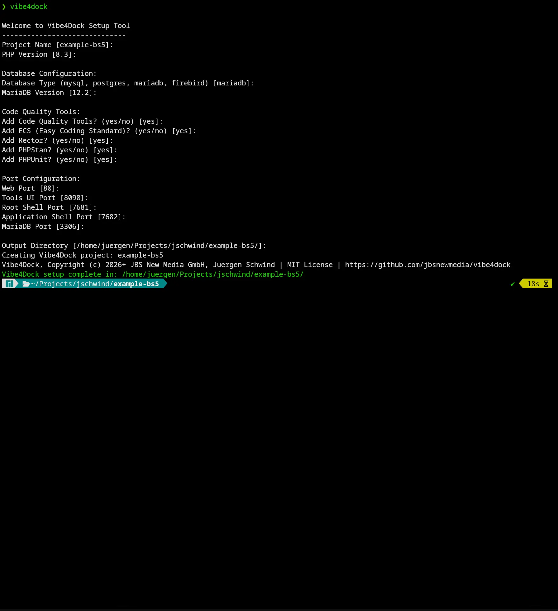

<p align="center">
  
</p>

# Vibe4Dock

For the German version, see [README.de.md](readme/README.de.md).

This documentation describes **Vibe4Dock 1.0.1**.

Vibe4Dock is a Docker-based development environment with a web interface for CLI tools, browser shells, and project-specific runtime extensions. The main reason this project exists is simple: it gives you direct web access to AI CLI tools so you can keep working on your project anytime - on your desktop, phone, tablet, while traveling, or basically from anywhere.

This repository contains both the Vibe4Dock skeleton template and the setup CLI (`./vibe4dock` or `php vibe4dock.php`). The setup CLI generates a new Vibe4Dock project exclusively from the bundled `skeleton/` directory.

Technically, Vibe4Dock consists of a PHP-based web container for the actual workspace and a separate tools service for the management UI. Optional runtime extensions such as databases are activated later through the tools interface, which generates provisioning, mount, and Compose override configuration dynamically from JSON definitions.



## Project goal

Vibe4Dock solves a common problem in local and team development setups: the base environment should start quickly, while optional tools should only be enabled when needed. At the same time, access to AI and developer tools should not be tied to a single machine. Instead of maintaining one huge static Docker image per project, Vibe4Dock lets you manage tools modularly and then use them comfortably through the browser.

This project is especially useful in setups where:

- a PHP-based web environment is needed,
- multiple CLI tools should be optionally available,
- configuration such as logins, caches, or dotfiles must persist,
- direct browser access to root and application shells is useful,
- people want to continue working productively through web access while remote or mobile,
- Docker mounts should be activated dynamically without manually editing Compose files.

## Setup CLI

The setup CLI creates a new Vibe4Dock project from the bundled `skeleton/` template. All generated project files come from that placeholder-based kit, so ports, image versions, and container names are rendered into copied templates instead of being hardcoded in the generator. Files in that directory are stored as `*.skeleton` templates and are written to the target project without the `.skeleton` suffix.

### Setting up the Vibe4Dock setup CLI

The CLI itself only requires PHP CLI version 8 or newer. No additional dependencies or Composer installation are required to run the setup tool.

Latest stable tag:

```bash
git clone --branch 1.0.1 --depth 1 https://github.com/jbsnewmedia/vibe4dock.git
cd vibe4dock
chmod +x vibe4dock
```

Development branch:

```bash
git clone https://github.com/jbsnewmedia/vibe4dock.git
cd vibe4dock
chmod +x vibe4dock
```

Optionally, you can create a symlink to make the CLI available globally:

```bash
sudo ln -s $(pwd)/vibe4dock /usr/local/bin/vibe4dock
```

After that, you can run the CLI directly:

```bash
./vibe4dock --help
```

If you do not want to make the file executable, this always works as well:

```bash
php vibe4dock.php --help
```

### Interactive start

```bash
./vibe4dock
```

Alternative:

```bash
php vibe4dock.php
```

Without options, the setup runs interactively and asks for the project name, PHP version, ports, and output directory. If you run it inside an existing Vibe4Dock project, the detected settings are prefilled automatically.

### CLI help

```bash
./vibe4dock --help
```

### Non-interactive usage

```bash
./vibe4dock \
  --project-name=my-vibe4dock \
  --php-version=8.4 \
  --web-port=80 \
  --tools-port=8090 \
  --root-shell-port=7681 \
  --app-shell-port=7682 \
  --output-dir=./build/my-vibe4dock
```

### Supported options

| Option | Meaning |
| --- | --- |
| `--project-name` | Name of the generated project |
| `--php-version` | PHP base version for the web image |
| `--web-port` | Host port for the web application |
| `--tools-port` | Host port for the tools UI |
| `--root-shell-port` | Host port for the root shell |
| `--app-shell-port` | Host port for the application shell |
| `--output-dir` | Target directory for the generated project |

## Architecture overview

Vibe4Dock starts two Docker services by default:

| Service | Purpose | Port(s) |
| --- | --- | --- |
| `web` | Main development environment with Apache/PHP, ttyd, shells, and installed tools | `80`, `7681`, `7682` |
| `tools` | Management UI for dashboard, categories, settings, and install/uninstall workflows | `8090` |

### `web` service

The web service is based on `webdevops/php-apache-dev:8.4` and extends that image with:

- `ttyd` for browser-based terminals,
- `tmux`,
- `git`,
- `sudo`,
- dynamic provisioning via `docker/web/provision.sh`,
- startup logic via `docker/web/entrypoint-dev.sh`.

On container startup, the following happens:

1. optional values from `.env.local` are loaded,
2. Git config is applied for the application user when enabled,
3. already enabled tools are reinstalled or verified using `docker/web/settings/installed_tools.json`,
4. persistent mounts are restored from backup directories,
5. permissions under `/home/application` are fixed,
6. two ttyd sessions are started:
   - root shell on port `7681`
   - application shell on port `7682`

This creates an environment that is not only usable locally on one machine, but reachable from any browser. That is exactly what makes Vibe4Dock attractive for working on the go: the project runs centrally in the container while access happens through the web UI and browser terminals.

### `tools` service

The tools service is a standalone PHP container based on `php:8.4-cli-bookworm`. It provides the management interface and has access to:

- the project directory via bind mount,
- the Docker socket,
- the configuration files for tools and settings,
- the target container `<project-name>-web-1`, where commands are executed.

The interface is not just informational; it actively manages:

- tool installation and removal,
- generation of `docker/web/provision.sh`,
- generation of `docker-compose.override.yml`,
- activation of the rebuild hint when installed packs add new mounts or services,
- status display for runtime, memory, disk, and installed tools.

### Bundled packs plus on-demand activation

The repository ships the base services together with a curated set of bundled tool and addon definitions. Generated projects stay clean in practice because tools, addon services, and their persistent directories are only activated when you install them through the Tools UI. Mount-backed directories and addon data folders are created on demand and removed again when no longer needed.

## Project structure

The most important files and directories:

| Path | Meaning |
| --- | --- |
| `docker-compose.yml` | Main service definition |
| `docker-compose.override.yml` | Generated automatically when installed packs add persistent mounts or optional services |
| `public/` | Web root of the `web` container |
| `docker/web/` | Dockerfile, entry logic, provisioning, and persistent tool data |
| `docker/tools/` | Management UI, dashboard, routing, and tool/settings definitions |
| `docker/tools/category/` | Tool definitions, sorted and merged by filename |
| `docker/tools/addons/` | Addon and optional service definitions, also sorted and merged |
| `docker/tools/settings/` | Settings definitions, also mergeable |
| `docker/web/settings/` | Persistent user data such as installed tools, caches, logins, and hint files |
| `docker/data/` | On-demand addon data directories such as database storage |
| `readme/` | Screenshot and documentation assets |

## Usage model

The tools UI on port `8090` is split into several areas:

- **Dashboard**
  - application shell
  - root shell
  - addon-provided browser shells, either by extending `web` or by exposing their own addon service ports
  - system information such as PHP, Composer, RAM, and disk status
  - configuration status
  - list of installed tools / addons
- **Tools**
  - one combined tools view with search and a category switcher
  - installable tools can expose a separate `Config` action after installation
  - Git Config now lives as a regular tool in its own `Git` category
  - categories appear only when tool packs provide them via JSON
- **Addons**
  - addon categories appear only when addon packs provide them via JSON

Installations and updates are triggered directly through form actions. While an action is running, the UI places a global loading layer with a spinner over the page until the response page loads.

## Why Vibe4Dock is especially useful

The core value is not just installing tools, but location independence. Vibe4Dock makes AI CLI tools and project access available over the web. That means the same development environment can be used:

- on an office desktop,
- on a personal laptop,
- on a phone,
- on a tablet,
- while traveling on a train or at a client site,
- anywhere a browser is available.

The real work stays inside the container and therefore inside one consistent environment. Device choice, operating system, and local machine setup become much less important.

## Tool and addon packs

Bundled definitions for **Vibe4Dock 1.0.1** are loaded from:

```text
docker/tools/category/
docker/tools/addons/
```

Current bundled tool packs:

- **AI CLI**: GitHub Copilot CLI, Codex CLI, Claude Code, Cline CLI, Hermes CLI, Junie CLI
- **Git**: Git Config, Lazygit
- **System & Runtime**: Node.js, pnpm, Yarn
- **PHP Frameworks**: Laravel CLI, Symfony CLI, WordPress CLI
- **Code Quality**: Code Quality Package

Current bundled addon packs:

- **Databases**: MariaDB, MySQL, PostgreSQL, Firebird
- **Browser Shells**: Lazygit Shell
- **Browser IDEs**: code-server

You can still add your own packs or overrides on top of these files.

## How tool installation works

Tool installation in Vibe4Dock is a multi-step process:

1. the UI triggers an action such as `install`, `update`, `switch`, or `uninstall`,
2. the tools service executes the configured command inside the `web` container,
3. the tool is marked as active in `docker/web/settings/installed_tools.json`,
4. if the tool requires persistent mounts, a rebuild hint is set,
5. `docker/web/provision.sh` is regenerated,
6. `docker-compose.override.yml` is regenerated when additional volumes are required.

### Provisioning

`docker/web/provision.sh` is generated automatically and contains:

- installation commands for all enabled tools,
- a topologically sorted order based on configured dependencies,
- backup logic for mounted tool directories,
- cleanup of old rebuild hint files.

### Dynamic volumes

Tools with persistent data define `mounts`. These are written automatically into `docker-compose.override.yml` so that data such as the following can survive rebuilds:

- npm cache,
- CLI login data,
- tool configuration,
- local agent data directories.

## Rebuild flow

Some tools require volume mounts. In that case, installing them in the running container alone is not enough. Vibe4Dock marks that state as:

**Manual Rebuild Required**

The rebuild is done with:

```bash
./docker/rebuild.sh
```

or on Windows:

```bat
./docker/rebuild.bat
```

This will:

1. run `docker compose down`,
2. rebuild the web container,
3. start the Compose setup again,
4. remove the rebuild hint from inside the container.

In addition, the UI polls rebuild status every 15 seconds. As soon as the hint file disappears, the banner fades out automatically.

## Configuration system

A central part of the project is the mergeable JSON configuration system.

### Tool definitions

Tool definitions live in:

```text
docker/tools/category/
```

Each file:

- ends in `.json`,
- is loaded in filename order,
- can define categories and tools,
- is merged with all other files.

Bundled tool files are already part of the repository in version 1.0.1, and additional team-specific or project-specific packs can be layered on top through the same merge mechanism.

### Addon definitions

Addon definitions live in:

```text
docker/tools/addons/
```

These files are loaded with the same merge rules as normal tools, but they usually contribute optional Compose services, ports, environment variables, persistent data directories, and dashboard-dockable browser endpoints such as shells or browser IDEs.

### Settings definitions

Settings live in:

```text
docker/tools/settings/
```

These files are also loaded by filename and merged.

Settings can optionally define `apply_commands`. Those commands are executed through the tools UI after saving a setting and can also be triggered centrally through `POST /action/settings/apply`.

### Merge rules

The merge logic lives in `docker/tools/config.php`:

- categories are merged by `unique_key`,
- tools are merged by `id`,
- settings are merged by `id`,
- files are processed alphabetically or numerically by filename,
- later files can selectively extend or override existing definitions.

Example file naming:

```text
100_base.json
200_team.json
300_project.json
```

This allows you to layer a base configuration, team-wide additions, and project-specific overrides cleanly.

## Structure of a tool definition

A tool can contain fields such as:

| Field | Meaning |
| --- | --- |
| `id` | Unique tool ID |
| `category` | Target category |
| `label` | Display name in the UI |
| `description` | Short description |
| `check` | Command used for status or version detection |
| `install` | Install command |
| `uninstall` | Uninstall command |
| `mounts` | Persistent volume mounts |
| `dependencies` | Installation prerequisites |
| `type` | Optional, e.g. `versioned` |
| `versions` | Version entries for versioned tools |
| `default_version` | Preselected version for versioned tools |
| `config_schema` | Optional config dialog definition for tool-specific settings |
| `apply_commands` | Optional commands executed after config changes or activation |
| `package_operations` | Optional package/file operations for project scaffolding tools |
| `compose_service` | Optional service definition used mainly by addons |
| `dashboard_shell` | Optional dashboard entry for browser-accessible shells or addon endpoints |

### Browser endpoint docking

Addons can dock into the dashboard in two generic ways:

1. by exposing their own host port and describing it via `dashboard_shell`
2. by extending the `web` service and adding a declarative `dashboard_shell.launcher`

Typical `dashboard_shell` fields:

| Field | Meaning |
| --- | --- |
| `label` | Dashboard card title |
| `port_field` / `port` | Host port from config or as a fixed value |
| `username_field` / `username` | Optional Basic Auth username |
| `password_field` / `password` | Optional Basic Auth password |
| `protocol` | Optional URL scheme such as `http` or `https` |
| `path` | Optional path appended to the URL |
| `button_label` | Optional button text |
| `help_title` / `help_text` / `help_command` | Dashboard help modal content |

This also supports password-only endpoints such as `code-server`, where no username is required but a configured password still counts as protected access.

For `web`-hosted browser shells, `dashboard_shell.launcher` supports a declarative runtime definition:

| Launcher field | Meaning |
| --- | --- |
| `type` | Currently `ttyd` |
| `service` | Currently `web` for in-container browser shells |
| `container_port` | Container port opened by the launcher |
| `run_as` | `application` or `root` |
| `working_directory` | Optional working directory before launch |
| `executable` | Command to launch |
| `arguments` | Optional argument list |
| `fallback_profile` | Optional fallback shell profile such as `application-shell` |
| `environment` | Optional extra environment variables |

Installed declarative launchers are materialized into `docker/web/settings/browser_shells.json`, which the web entrypoint reads on startup to spawn additional browser shells without hardcoded addon-specific logic.

Examples of bundled browser endpoints:

- **Lazygit Shell**: additional ttyd session inside the `web` container
- **code-server**: separate addon service with its own port and password-protected browser IDE

## Settings

Settings definitions remain supported, but the bundled Git identity flow now ships as a regular tool instead of a legacy setting card.

- **Git Config** (tool category `Git`)
  - install/uninstall through the normal tools workflow
  - configuration via the tool-level `Config` dialog
  - `GIT_USER_NAME`
  - `GIT_USER_EMAIL`

The values are written into `.env.local`. Optional `apply_commands` make the runtime application neutral and definition-driven instead of hardcoding setting-specific behavior in PHP.

Generated projects also include a commented `.env.local.example` with optional HTTP Basic Auth credentials for the Tools UI, the application shell, and the root shell.

To enable that protection, copy the file to `.env.local`, uncomment the variables you need, and replace the placeholder passwords before starting the stack:

```dotenv
TOOLS_USERNAME="tools"
TOOLS_PASSWORD="replace-with-a-strong-password"
APP_SHELL_USERNAME="application"
APP_SHELL_PASSWORD="replace-with-a-strong-password"
ROOT_SHELL_USERNAME="root"
ROOT_SHELL_PASSWORD="replace-with-a-strong-password"
```

## Persistence

Persistent data is intentionally stored outside the image in mounted directories under `docker/web/settings/`.

Examples:

- `docker/web/settings/copilot`
- `docker/web/settings/claude`
- `docker/web/settings/cline`
- `docker/web/settings/codex`
- `docker/web/settings/code-server/config`
- `docker/web/settings/code-server/data`
- `docker/web/settings/hermes`
- `docker/web/settings/junie`
- `docker/web/settings/lazygit`
- `docker/web/settings/npm`

Addon services also persist their runtime data outside the image, for example:

- `docker/data/mariadb`
- `docker/data/mysql`
- `docker/data/postgresql`
- `docker/data/firebird`

Technical state files are also stored there:

- `installed_tools.json`
- `browser_shells.json`
- `rebuild_required.hint`

## Browser access

Vibe4Dock provides two built-in browser shells plus addon-provided dashboard endpoints such as extra shells or browser IDEs:

| Shell | Purpose | Port |
| --- | --- | --- |
| Root Shell | Administrative tasks inside the container | `7681` |
| Application Shell | Normal development work as `application` | `7682` |

The application shell starts through `tmux` so sessions can persist. Additional browser shells can be registered declaratively by addons, and separate addon services such as `code-server` can expose their own browser IDE ports while still appearing on the same dashboard.

## Starting the project

### Requirements

- Docker
- Docker Compose

### Start

```bash
cp .env.local.example .env.local
docker compose up -d --build
```

After that, the most important endpoints are:

- application: `http://localhost:80`
- tools UI: `http://localhost:8090` (protected if both `TOOLS_USERNAME` and `TOOLS_PASSWORD` are set in `.env.local`)
- root shell: `http://localhost:7681` (protected if both `ROOT_SHELL_USERNAME` and `ROOT_SHELL_PASSWORD` are set in `.env.local`)
- application shell: `http://localhost:7682` (protected if both `APP_SHELL_USERNAME` and `APP_SHELL_PASSWORD` are set in `.env.local`)

## Typical workflow

1. start Vibe4Dock,
2. open the tools UI,
3. add or install the tool and addon packs you need,
4. if a rebuild is required, run `./docker/rebuild.sh`,
5. continue working inside the application shell.

## Extending the system

### Add a new tool file

New tools or overrides should go into their own file under `docker/tools/category/`, for example:

```text
docker/tools/category/200_custom.json
```

### Add a new category

New categories need:

- `unique_key`
- `id`
- `label`
- `order`

### Add a new setting

New settings are added as additional entries under `docker/tools/settings/*.json`.

## Notes on the current implementation

- The tools UI is server-rendered PHP without a framework.
- Routing is implemented directly in `docker/tools/index.php`.
- Provisioning and override generation happen from the current configuration state.
- The system is intentionally pragmatic and easy to extend.
- Because the tools container has access to the Docker socket, the management UI has wide-reaching access to the local Docker environment.

## Security and operational considerations

Vibe4Dock is clearly intended as a development tool, not as a hardened multi-tenant platform. In particular:

- the tools container has access to `/var/run/docker.sock`,
- installation commands are executed inside the web container,
- some tools install software directly as root,
- generated projects can optionally protect the Tools UI and both browser shells via `.env.local`,
- persistent mounts may contain logins, tokens, and local configuration.

If you want to use Vibe4Dock beyond localhost, at minimum enable the HTTP Basic Auth credentials from `.env.local`, replace all placeholder passwords, and put the setup behind additional network-level protection such as a VPN, reverse proxy access control, or a private subnet.

Because of that, this setup is not intended for direct public internet exposure without additional hardening.

## Known characteristics

- Tools or addons that add mounts or services require a manual rebuild.
- Depending on the tool, installations may require network access and external package sources.
- Some CLIs only store login data after their first interactive start.
- The Compose override is generated from the currently selected tools and optional services.

## Summary

Vibe4Dock is a modular, Docker-based development workspace with a web interface for tool management, browser terminals, persistent CLI configuration, and dynamically generated container provisioning. Its biggest advantage is browser-based access to AI CLI tools and project environments, so work on a project remains possible anytime and from practically anywhere.
